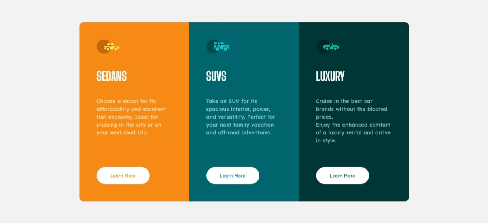

# Frontend Mentor - Stats preview card component solution

Esta es una solución para el desafío del [3-column preview card component](https://www.frontendmentor.io/challenges/3column-preview-card-component-pH92eAR2-). Los desafíos de Frontend Mentor le ayudan a mejorar sus habilidades de codificación mediante la creación de proyectos realistas. 

## Visión general

### Reto

Los usuarios deben ser capaces de:

- Ver el diseño óptimo en función del tamaño de pantalla de su dispositivo

### Captura de resultado

### Enlaces

- [URL Solución](https://www.frontendmentor.io/solutions/stats-preview-card-component-3OzThv6t_)
- [URL del sitio en vivo](https://fm-3columnpreviewcardcomponent.netlify.app/)

## Mi proceso

### Construido con

- Semantic HTML5 markup
- CSS custom properties

## Autor

- Website - [Esmith Sánchez](https://esmithas.github.io/)
- Frontend Mentor - [@EsmithAS](https://www.frontendmentor.io/profile/EsmithAS)